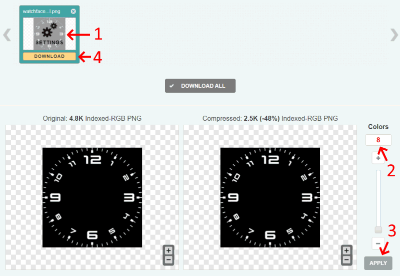

# PG-TTGO-Watchfaces
Watchfaces for Lilygo T-Watch-2020

Firmware: https://github.com/sharandac/My-TTGO-Watch

Original watchfaces: https://github.com/sharandac/My-TTGO-Watchfaces

# Configure watch
To browse and install watchfaces from this repository, you need to change a file in watch file system:
1. Activate Wifi & FTP in watch
2. To prevent watch going to sleep, you should disable the display timeout
3. On PC connect to watch with any FTP application
4. Open `watchface.json` file with an editor
5. Set `watchface_theme_url` config to: `https://raw.githubusercontent.com/PGNetHun/PG-TTGO-Watchfaces/main`
6. Save `watchface.json` file to watch
7. You can now open watchface manager app on the watch

# Images
Watchface images are downloaded from: https://www.cleanpng.com/

Process of image post-processing:
1. Crop image to have 1:1 aspect ratio
2. Add background color if image has transparent area
3. Resize to 240x240 pixels
4. Save as PNG file, format: 8 bit
5. Upload file to online PNG compression site: https://compresspng.com/
6. Open image settings (see screenshot below)
7. Decrease colors count till image quality is still sufficient
8. Download compressed image
9. Copy-paste image file to watchface folder, and rename it to `watchface_dial.png`

