# PG-TTGO-Watchfaces

Watchfaces for Lilygo T-Watch-2020

Firmware: https://github.com/sharandac/My-TTGO-Watch  
Original watchfaces: https://github.com/sharandac/My-TTGO-Watchfaces

# Configure watch

To browse and install watchfaces from this repository, you need to change a file in watch file system:
1. Activate Wifi & FTP in watch
2. To prevent Wifi turning off automatically, either disable display timeout, or enable Wifi in standby mode
3. On PC connect to watch with any FTP client application
4. Open `watchface.json` file with an editor
5. Set `watchface_theme_url` config to: `https://raw.githubusercontent.com/PGNetHun/PG-TTGO-Watchfaces/main`
6. Save `watchface.json` file to watch
7. You can now open watchface manager app on the watch

# Create new watchface

1. Download a watchface image you like and post-process it (see steps below)
2. Add images of handles if needed (for analogue watchface)
3. Create and configure `watchface_theme.json` file
4. Compress files to `watchface.tar.gz`
5. FTP upload compressed file to watch
6. Install watchface theme on watch
7. Create screenshot of watch display (long press power button, then touch camera icon)
8. FTP download `screen.png` file to the watchface folder, and rename it to `watchface_theme_prev.png`
9. Copy-paste `watchface_theme_prev.png` to `watchface_theme_prev_120px.png` and resize it to 120x120 pixels
10. Add new watchface to `watchface_theme_list.json` file

# Images

Watchface images are downloaded from: https://www.cleanpng.com/

Process of image post-processing:
1. Crop image to have 1:1 aspect ratio
2. Add background color if image has transparent area
3. Resize to 240x240 pixels
4. Save as PNG file, format: 24 or 32 bit
5. Upload file to online PNG compression site: https://compresspng.com/
6. Open image settings (see screenshot below)
7. Decrease colors count till image quality is still sufficient
8. Download compressed image
9. Copy-paste image file to watchface folder, and rename it to `watchface_dial.png`

# Fonts

At the moment only Ubuntu font can be used, size: 12px, 16px, 32px, 48px, 72px

Firmware built-in fonts: https://github.com/sharandac/My-TTGO-Watch/tree/master/src/gui/font

# Screenshots

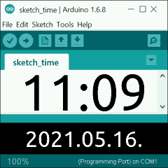

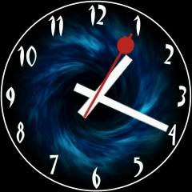
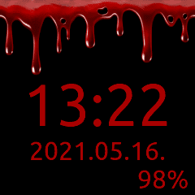
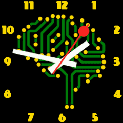
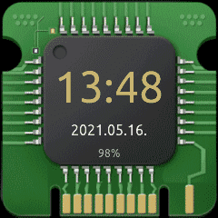
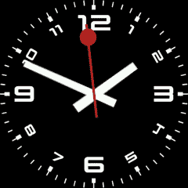

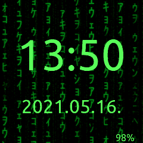
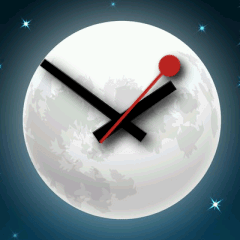
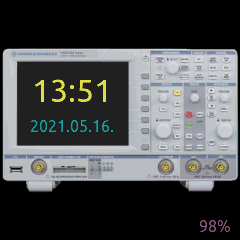
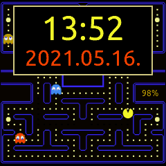

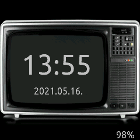
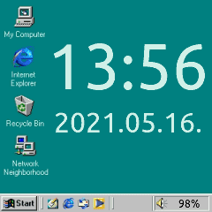
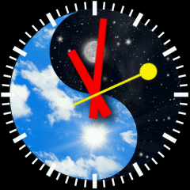
